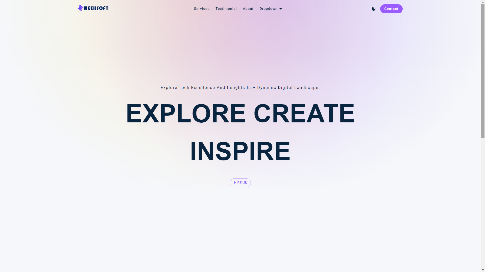
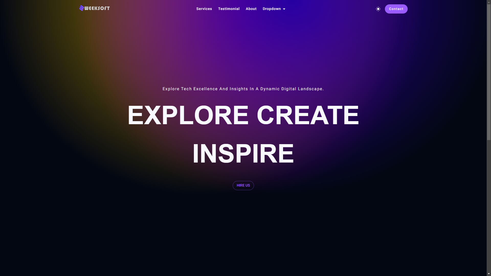

# Sweeksoft Nextjs Theme Light

A minimalistic and responsive Next.js theme for building clean and modern web applications.

## Live Preview

Check out the live preview of the Sweeksoft Nextjs Theme Light[here](https://vercel.com). You can also visit the theme link is [here](https://sweeksoft.com/products/sweeksoft-nextjs-theme-light).

## Images

### Light Mode



### Dark Mode



## Features

- **Minimal Design:** Clean and uncluttered visuals for a sleek user interface.
- **Responsive Layout:** Ensures optimal display on various devices and screen sizes.
- **Easy Customization:** Customize colors, typography, and other design elements effortlessly.
- **Dark Mode:** Seamlessly switch between light and dark themes for user preference.
- **Modular Components:** Reusable React components for easy integration and maintenance.
- **Optimized Performance:** Efficient asset loading and rendering for improved performance.
- **Accessible Design:** Prioritizes accessibility standards for an inclusive user experience.
- **Next.js Integration:** Takes advantage of Next.js features for server-side rendering and code splitting.
- **Scalability:** Designed to scale as your application grows, ensuring maintainability and extensibility.
- **SEO-Friendly:** Implements SEO best practices for improved search engine visibility.

## Getting Started

Follow these steps to integrate the Sweeksoft Nextjs Theme Light into your Next.js project:

1. **Clone the repository or free download from [here](https://sweeksoft.com/products/sweeksoft-nextjs-theme-light):**

   ```bash
   git clone https://github.com/sweeksoft/nextjs/sweeksoft-nextjs-theme-light.git

   ```

2. **Enter to the project root if not already:**

   ```bash
   cd sweeksoft-nextjs-theme-light

   ```

3. **Install dependencies:**

   ```bash
   npm install

   ```

4. **Start development Server:**
   ```bash
   npm run dev
   ```

This command will start the development server, and you can view your Sweeksoft Nextjs Theme Light at http://localhost:3000 in your browser.

5. **Build for production:**
   ```bash
   npm run build
   ```

To build the theme for production, use this command. The optimized assets will be available in the ./out directory.

6. **Run production build:**
   ```bash
   npm start
   ```

After building for production, use this command to run the production server and view your live production theme.

## License

This project is licensed under the [MIT License](LICENSE).

**Copyright © Designed by www.sweeksoft.com**

You are free to use, modify, and distribute this software in accordance with the terms of the MIT License. See the [LICENSE](LICENSE) file for details.

## Hire Us

Need help customizing the Sweeksoft Nextjs theme or any other custom software project? [Email us](mailto:info@sweeksoft.com) or [Visit here](https://sweeksoft.com/contact) to discuss your requirements and get a quote.

---

Feel free to replace `sweeksoft` with the actual name or entity behind the design, and update the email and contact information accordingly. This addition makes it clear that the design is copyrighted by the specified entity.
